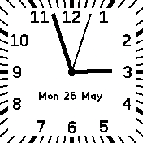

# Square Analog

## Features

* Follows system color theme
* Second hand is shown when unlocked
* Weekday and date are displayed over the clock hands
* Widgets are swipeable from the top

## Settings

* `Text above hands`: Disable to display date below the clock hands
* `Load widgets`: Disable to not load widgets

***

Thanks to the developers of [Analog Dark (andark)](https://banglejs.com/apps/?id=andark), which this is based on.
